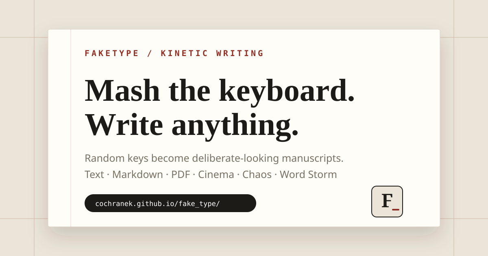

# FakeType



**Mash the keyboard. Write anything.**

[Live Demo](https://cochranek.github.io/fake_type/) · [QA checklist](QA.md) · [Changelog](CHANGELOG.md) · [Contributing](CONTRIBUTING.md)


FakeType is a browser-based kinetic writing playground. Every random keystroke advances a manuscript, so you can perform the *appearance* of fast, deliberate writing without typing the actual text. Paste your own material, load Markdown or a PDF, then type nonsense and watch the document unfold.

The project is a framework-free static web app deployed directly with GitHub Pages.

## Try it in 20 seconds

1. Open the **[Live Demo](https://cochranek.github.io/fake_type/)**.
2. Press **Start typing** and mash random keys — or tap the on-screen keyboard on touch devices.
3. Pick **Presets** for an instant demo, or import your own text / Markdown / PDF.
4. Raise **Chaos**, enable **Storm**, then press `F` for Cinema mode.
5. Use **Export** to save the currently revealed performance as Markdown.

## Highlights

- **Fake typing engine** — physical or virtual keyboard input advances the hidden manuscript.
- **Touch-ready virtual keyboard** — phones and tablets can perform the same interaction without a hardware keyboard.
- **Presets** — research paper, keynote, manifesto, and Chinese clinical-note demos.
- **Custom text import** — paste plain text or Markdown; headings become manuscript sections.
- **Drag & drop** — load `.txt`, `.md`, and PDF files directly in the browser.
- **PDF manuscript import** — PDF.js extracts text locally and FakeType detects common academic sections.
- **Two-column PDF heuristic** — attempts to restore reading order for common scholarly layouts.
- **PDF progress + cancel** — large documents show per-page analysis progress and can be canceled.
- **Scanned-PDF guidance** — image-only files get a clear OCR-oriented failure message instead of a generic error.
- **Demo mode** — automatically performs keystrokes while gradually increasing Chaos.
- **Export** — save the currently revealed manuscript as Markdown.
- **English / 中文 UI** — switch the interface language at any time.
- **Typing audio** — lightweight Web Audio feedback for keystrokes and revisions.
- **Chaos control** — four visual intensity tiers progressively disturb the formal paper layout.
- **Academic Breakdown** — extreme Chaos adds page jolts, drifting sections, stronger cursor behavior, and kinetic bursts.
- **Word Storm** — optional kinetic text particles; extreme Chaos can trigger bursts automatically.
- **Cinema mode** — press `F` for a distraction-free fullscreen performance view.
- **Shareable settings** — language, tempo, chaos, sound, storm, and cinema can be encoded in the URL.
- **PWA/offline shell** — the local application shell is cached for repeat visits.
- **Accessibility + reduced motion** — skip navigation, focus styles, progress semantics, ARIA labels, and `prefers-reduced-motion` support.

## Controls

| Shortcut | Action |
| --- | --- |
| Any unmodified key | advance the manuscript |
| Tap/click an on-screen key | advance the manuscript on touch devices |
| `F` | toggle Cinema mode |
| `Ctrl/⌘ + O` | open text import |
| `Ctrl/⌘ + E` | export the visible manuscript |
| `Ctrl/⌘ + D` | toggle Demo mode |
| `Ctrl/⌘ + /` | open help |

Modifier-based shortcuts are intentional: ordinary letter keys remain available as fake-typing input.

## Markdown structure

Markdown headings become manuscript sections:

```md
# My Paper

## Abstract
This becomes the abstract.

## Introduction
This becomes another section.
```

If no headings are present, FakeType treats the whole document as one body section.

## Export behavior

Export creates a local `.md` download containing only the part of the manuscript that is **currently revealed on screen**. It behaves as a performance snapshot rather than a way to silently recover the entire hidden source document.

## Shareable URL settings

```text
?lang=zh&tempo=92&chaos=70&storm=1&sound=0&cinema=1
```

| Parameter | Meaning |
| --- | --- |
| `lang=en|zh` | interface/manuscript language |
| `tempo=24..150` | automatic typing tempo |
| `chaos=0..100` | revision probability and visual intensity |
| `storm=1` | enable Word Storm bursts |
| `sound=0` | start muted |
| `cinema=1` | start in Cinema layout |

Imported document content is deliberately **not** encoded into share URLs.

## PDF handling

PDF import runs in the browser using a pinned PDF.js build. FakeType:

1. reads each page,
2. groups nearby text items into lines,
3. applies a two-column reading-order heuristic when appropriate,
4. detects common headings such as Abstract, Introduction, Methods, Results, Discussion, Conclusion, References, and common Chinese equivalents,
5. falls back to chunked body sections when a reliable structure cannot be detected.

PDF parsing is intentionally heuristic rather than a full scholarly-document parser. Complex layouts, equations, tables, unusual columns, and scanned/image-only PDFs can still be imperfect. PDFs over 80 MB are rejected before parsing to reduce the risk of freezing the browser. Image-only PDFs should be OCR'd first or converted to pasted text.

## Privacy

Imported text and files are processed locally in the browser and are not uploaded by FakeType. PDF.js itself is loaded from a public CDN, while the selected PDF remains local to the page.

Share URLs contain interface settings only, not imported manuscript content. See [SECURITY.md](SECURITY.md) for the project's security boundary and reporting guidance.

## Offline / PWA behavior

`manifest.webmanifest`, `favicon.svg`, and `sw.js` make FakeType installable as a lightweight web app on supported browsers. Navigation uses a network-first strategy, while static local assets use stale-while-revalidate so returning users get offline resilience without being trapped on stale deployments.

PDF.js is still loaded from a CDN, so **offline PDF importing is not guaranteed**. Built-in manuscripts, presets, text import, fake typing, export, Cinema, and Chaos effects remain local features.

## Architecture

```text
index.html               # semantic application shell
styles.css               # core paper UI and responsive layout
app.js                   # typing engine, imports, audio, storm, sharing and runtime

enhancements.css         # presets/help/demo/export + Academic Breakdown styling
enhancements.js          # optional product/interaction enhancement layer

qa.css                   # mobile, focus and touch polish
qa.js                    # accessibility, touch keyboard and browser guardrails
QA.md                    # manual release checklist

manifest.webmanifest     # installable web-app metadata
favicon.svg              # application icon
sw.js                    # offline shell cache
social-card.svg          # README / project branding card
robots.txt               # crawler directives
sitemap.xml              # GitHub Pages sitemap

tests/smoke.spec.js      # Playwright critical-path browser tests
playwright.config.js     # desktop + mobile Chromium test configuration
.github/workflows/       # static validation + browser CI
```

There is no framework or application build step. The core runtime, optional product features, and QA/accessibility layer are deliberately separated so the experience can evolve without destabilizing PDF and typing logic.

## Performance

FakeType does **not** keep a permanent animation loop alive. `requestAnimationFrame` runs only while automatic typing is active or Word Storm particles exist. When the page is idle, the animation loop stops.

Demo mode uses a temporary interval and restores the user's Tempo and Chaos values when it stops.

## Browser support

A current Chromium, Firefox, or Safari release is recommended. PDF import requires dynamic ES modules and Web Workers. Fullscreen behavior depends on browser permissions; the Cinema layout still works if fullscreen is unavailable. PWA installation support varies by browser/platform.

Automated smoke tests currently exercise desktop and mobile Chromium. The manual cross-browser release matrix lives in [QA.md](QA.md).

## Development

Serve the repository root with any static server:

```bash
python3 -m http.server 8000
```

For browser smoke tests:

```bash
npm install
npx playwright install chromium
npm test
```

For the lightweight syntax checks used by static CI:

```bash
node --check app.js
node --check enhancements.js
node --check qa.js
node --check sw.js
node --check playwright.config.js
node --check tests/smoke.spec.js
```

See [CONTRIBUTING.md](CONTRIBUTING.md) before making larger changes and [CHANGELOG.md](CHANGELOG.md) for release history.

---

FakeType is a playful interface experiment around writing, performance, structure, and controlled chaos.
